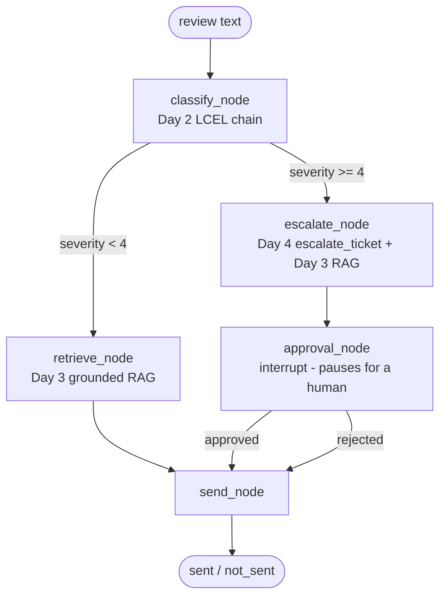

# ReviewGuard

An agent that takes a customer review → judges sentiment → analyzes it → suggests a **grounded**
resolution from a real knowledge base → escalates and pauses for human approval when the customer
is angry, surviving a process restart mid-approval.

Built day-by-day as a learn-by-building project (see `reviewguard-build-plan.md`) — every backend
function was hand-written and reviewed line by line, not generated. One commit per day; the git
history is the actual portfolio. Full list of what broke and why is in [`FAILURES.md`](FAILURES.md).

## Architecture



Routine reviews (severity < 4) get a grounded resolution drafted and sent automatically. Severe
or angry reviews (severity ≥ 4) get a real support ticket, a drafted resolution, and then the
graph **genuinely pauses** at `approval_node` until a human approves or rejects it — confirmed by
killing the process mid-pause and resuming it in a separate process using only the persisted
SQLite checkpoint (see Day 6 in `FAILURES.md`).

## Stack

- **Model**: Google Gemini (`gemini-3.5-flash`) via the AI Studio free tier — the original plan
  targeted Anthropic, but was migrated early (see Day 1 in `FAILURES.md`); old Anthropic call
  sites are kept as comments rather than deleted, for reference.
- **RAG**: Chroma (persistent, local) + BM25 (`rank_bm25`) fused with Reciprocal Rank Fusion,
  reranked with a cross-encoder (`sentence-transformers`).
- **Orchestration**: hand-written tool loop (Day 4) → `langchain.agents.create_agent` (Day 5) →
  explicit `langgraph.graph.StateGraph` (Day 6) — each stage built to feel the layer underneath
  the next one before trusting it.
- **Tracing**: LangSmith, verified by querying its API directly for real runs, not just assuming
  a non-error meant tracing worked.
- **Eval**: a scored end-to-end test set (`eval/e2e_eval.py`) that exits 1 on regression — proven
  against an actual injected quality regression, not just written and trusted.

## Setup

```bash
python3 -m venv .venv
source .venv/bin/activate
pip install -r requirements.txt
cp .env.example .env   # fill in GOOGLE_API_KEY (aistudio.google.com/apikey) and LANGSMITH_API_KEY
```

Build the retrieval index once (or whenever `data/kb/` changes):

```bash
python3 -m src.ingest
```

Run the eval / CI gate:

```bash
python3 -m eval.e2e_eval   # exits 1 if score drops below 0.80
python3 -m eval.retrieval_eval   # retrieval hit-rate, naive vs hybrid
```

## Running the app

Backend (from the repo root):

```bash
uvicorn src.api:app --reload
```

Frontend (React + TypeScript + Tailwind, calls the backend at `http://localhost:8000` by default -
override with `VITE_API_URL` if needed):

```bash
cd frontend
npm install
npm run dev
```

For a production build (`npm run build`), Vite bakes `VITE_API_URL` in at build time from a real
environment variable - set it in your deploy platform's dashboard (see `frontend/.env.production.example`
for the variable name), not in a committed file. A committed production URL would mean anyone who
forks this repo and deploys their own copy silently builds against *your* backend instead of their
own.

Open the printed `http://localhost:5173` URL. Routine reviews get a resolution automatically;
severe reviews pause with an Approve/Reject panel backed by Day 6's `interrupt()`.

## Retrieval: measured, not assumed

The single most differentiating piece of this project, per the plan's own framing — retrieval
quality was actually measured before and after an upgrade, not just built and hoped for:

| | hit_rate@1 |
|---|---|
| Naive vector search only | 0.83 (15/18) |
| + BM25 + Reciprocal Rank Fusion + cross-encoder rerank | **0.94** (17/18) |

The one query that still misses in both versions ("I want to return this, it doesn't fit" →
matches `damaged_item_guide.md` instead of `return_exchange_policy.txt`) isn't a retrieval
algorithm problem — the two docs are genuinely close in *meaning*, and the real fix is clearer
knowledge base content, not a better algorithm. Full breakdown in `FAILURES.md`.

## What actually broke (highlights — full log in FAILURES.md)

- **Bare Gemini model names can silently resolve to Vertex AI** (a different Google product,
  incompatible credentials) via `init_chat_model` unless the `google_genai:` prefix is explicit.
- **Free-tier quota is scoped to the Google Cloud project, not the API key** — a fresh key from
  the same account doesn't reset an exhausted daily cap.
- **`create_agent` doesn't recover from tool errors or step-limit overruns by default** — both
  crash the whole run; Day 6's LangGraph `retry_policy` is the direct fix.
- **LangGraph's checkpoint serialization won't indefinitely trust arbitrary Pydantic objects** in
  `State` — a real forward-compatibility warning caught by actually reading the output, not just
  checking for a non-zero exit code.
- **Always verify a fast-moving SDK against what's actually installed**, not training-data memory
  — this bit twice (MCP's `FastMCP` → `MCPServer` rename, LangGraph SQLite checkpointer API).
